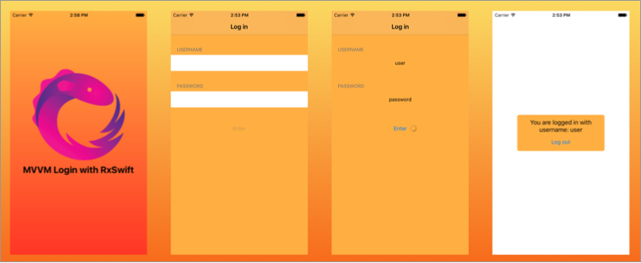

# Really Simple MVVM Login Example With RxSwift

This project shows usage of MVVM and RxSwift.

# Getting Started
The application uses `node.js` as backend REST client which is running at `http://localhost:3000`.

Make sure you have `node.js` and `npm` installed.

1. `git clone https://github.com/carlosypunto/ReallySimpleMVVMLoginExampleWithRxSwift.git`
2. `cd ReallySimpleMVVMLoginExampleWithRxSwift/server`
3. `npm update`
4. `node server.js`

and run `pod install` in the iOS project.

To log in, use the following credentials:
* `username`: user
* `password`: password

To get a server error, use:
* `username`: error
* `password`: any you want

To get bad credentials error, do not use any of the above cases.

# Questions
If you have any questions about the project, please open an issue or ask questions at [rxswift.slack.com](rxswift.slack.com)

Pull requests are welcome!

# Licence
MIT ofc.
